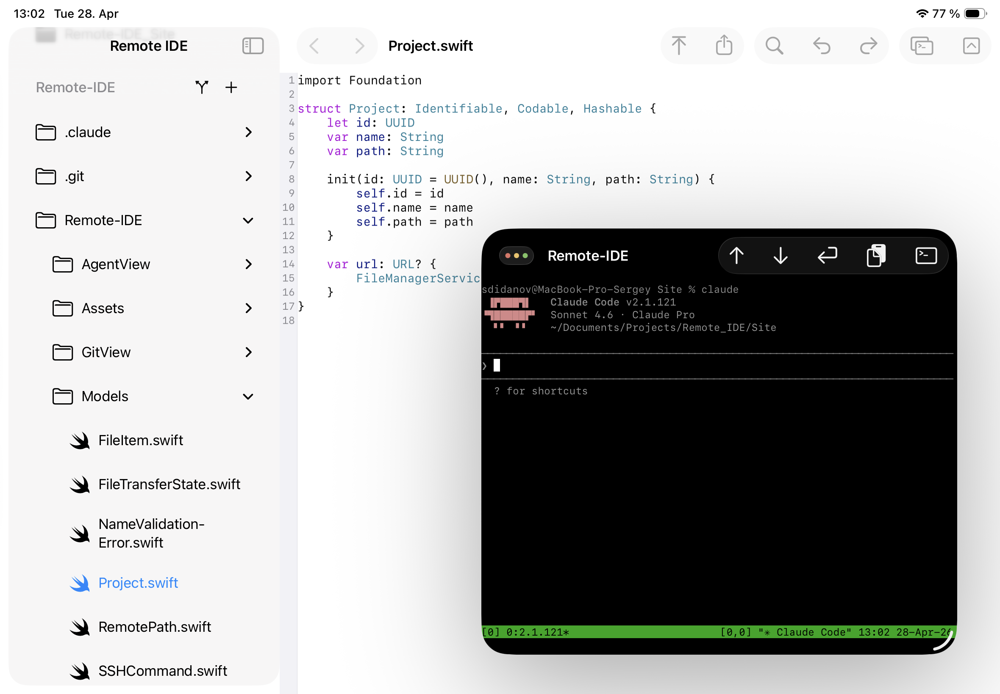

# Remote IDE

**Remote IDE** is a full-featured development environment for iPad that combines a local code editor, SSH terminal, and file sync — all in one app.

---

## Screenshots

---

## Features

### 📁 File Manager
- Manage local projects stored in iCloud Drive
- Create, rename, delete files and folders
- Browse nested project structure in a sidebar

### ✏️ Code Editor
- Syntax highlighting for Swift, Python, JavaScript, TypeScript, Go, Rust, C/C++, Ruby, PHP, Shell, JSON, YAML, Markdown, HTML, CSS, and more — powered by [Runestone](https://github.com/simonbs/Runestone) and Tree-sitter
- Auto-detect language by file extension
- Undo / Redo, Find & Replace
- Quick-input toolbar with Tab, `()`, `.`, `=`, `#` keys
- Auto-save on every change

### 🖥️ SSH Console
- Full interactive terminal via SSH — powered by [SwiftTerm](https://github.com/migueldeicaza/SwiftTerm)
- ANSI/VT100 support, scrollable buffer
- Save and run custom SSH commands with one tap
- Quick-repeat last command button

### 🔄 File Sync over SFTP
- Upload entire project to a remote server in one tap
- Download remote directory back to iPad
- Progress indicator with cancel support

### 🤖 AI Agent Window
- Dedicated terminal window for running AI coding agents (e.g. Claude Code) over SSH
- Paste clipboard images directly into the prompt
- Arrow key and Enter buttons for hands-free agent interaction

### 🌿 Git Status Viewer
- View changed files and diffs for your project
- Dedicated Git window with split sidebar/detail layout

### 🔐 Security
- SSH passwords and private keys stored exclusively in the system Keychain
- No credentials ever written to disk or UserDefaults
- SSH connections are only established on explicit user action

---

## Requirements

- iPadOS 26 or later
- Works with all iPad models supporting iPadOS 26
- SSH access to a remote Linux server (for SSH features)

---

## Support & Feedback

Found a bug or have a feature request? Please open an [Issue](https://github.com/sergeydi/Remote-IDE_Support/issues) in this repository.

---

## License

This repository is used for issue tracking and support. The app source code is proprietary.
